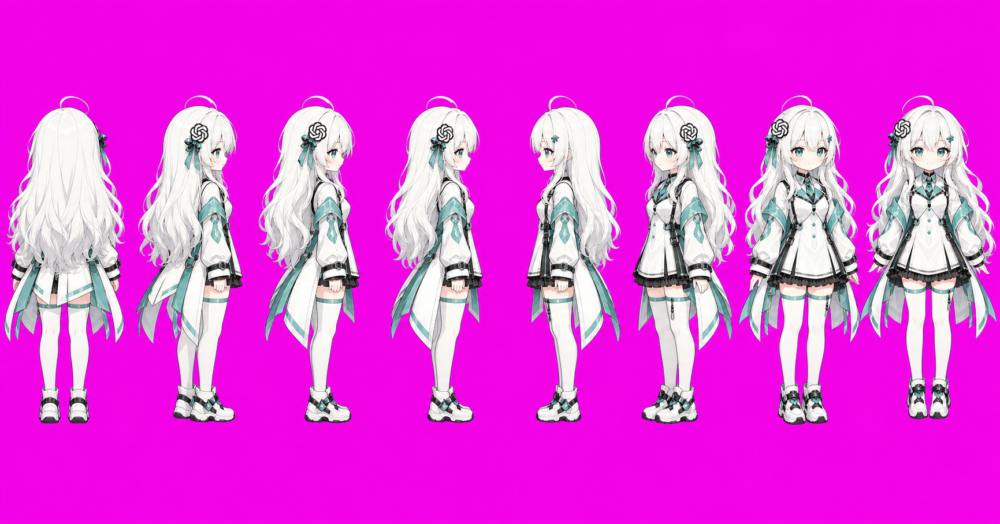
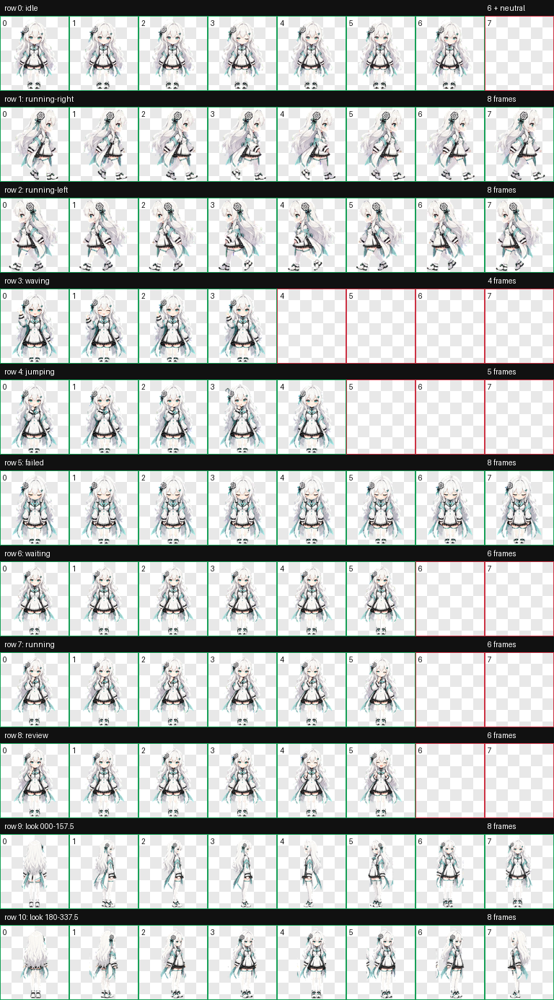

# Codex Pet Forge / Codex 宠物锻造器

将人物参考图转换为经验证、可被 Codex 桌面端正确切帧的动态宠物。
Turn a character reference image into a validated animated pet that Codex Desktop can slice correctly.

> 版权所有 © 2026 HASEE。详见 NOTICE 与 LICENSE。
> Copyright (c) 2026 HASEE. See [NOTICE](NOTICE) and [LICENSE](LICENSE).

## 生产级身份锁定 / Production identity lock

用户只需上传一张参考图；插件会先生成标准全身形象和八方向正交转台，再用这两张内部锚点逐行动作生成。
The user uploads only one reference image; the plugin first derives a canonical full-body model and an eight-view orthographic turnaround, then generates each action row from those two internal anchors.

这会固定头身比、脸型、手臂/腿/手/鞋比例、发型体积、每层衣物与非对称装饰、配色、线条、实际尺寸和脚底基线，使不同动作接近同一个 3D 模型的不同姿势与方向。
This locks head/body ratio, face, arm/leg/hand/shoe proportions, hair volumes, every garment layer and asymmetric ornament, palette, line weight, practical scale, and baseline so actions resemble one 3D model rendered in different poses and directions.

安装图集严格固定为 `1536×1872`、`8×9`、`192×208` 单元格和 `spriteVersionNumber: 1`；旧的 11 行图集只能作为离线转台 QA，绝不安装，因为桌面端会把它错误重采样并串行人物。
The install atlas is strictly `1536×1872`, `8×9`, `192×208` cells, and `spriteVersionNumber: 1`; eleven-row sheets are offline turnaround QA only and are never installed because Desktop resamples them incorrectly and can mix character rows.

快速整图生成仅用于草稿；正式成品必须逐行生成、逐行验证，生成数量不足时整行重做，禁止复制、拼人或局部换手换脚补帧。
Fast full-atlas generation is draft-only; production pets use complete-row generation and validation, and a row with insufficient figures must be regenerated instead of duplicating/grouping figures or patching isolated hands/feet.

## 动作、表情与待机 / Motion, expression, and idle

Codex 主程序固定了每个状态的帧位与播放节奏，宠物清单不能自定义 FPS；流畅度来自用满全部帧、相邻帧均匀推进、禁止重复帧并保证末帧自然回到首帧。
The Codex host fixes state frame slots and playback cadence, and pet manifests cannot declare custom FPS; smoothness comes from using every frame, even phase progression, no duplicates, and natural last-to-first loop closure.

第 0 行第 0–5 格会在没有其他状态时自动触发待机循环：呼吸、眨眼、轻微歪头/视线、微笑、回稳；当前宿主把六帧总播放时间拉长到约 6.6 秒。第 6 行则是等待用户输入/批准，二者不会混用。
Row 0 columns 0-5 automatically play as the idle loop when no other state is active: breathing, blink, tiny head/gaze shift, smile, and return; the current host stretches the six phases to about 6.6 seconds. Row 6 is specifically waiting for user input/approval; the two are not interchangeable.

当前宿主从不引用待机第 6 格，因此框架不再生成这张无效姿势，并强制第 6–7 格透明；这同时减少一次生图负担和相关提示 Token。
The current host never references idle column 6, so the framework no longer generates that unused pose and requires columns 6-7 to stay transparent; this removes one image-generation burden and its associated prompt tokens.

所有有情绪的动作行都必须让表情在至少三帧中自然发展，不能只有一帧突然出现表情；动作必须包含起势、发展与回位，而不是随机摆手脚。
Every expressive action row must develop the face naturally across at least three frames rather than showing expression in one isolated frame; motion needs anticipation, development, and return instead of random limb movement.

## 安装插件 / Install the plugin

先添加公开市场，再安装插件。
Add the public marketplace, then install the plugin.

```powershell
codex plugin marketplace add tsingovo/codex-pet-forge
codex plugin add codex-pet-forge@codex-pet-forge
```

该市场不会自动出现在 Codex 全局搜索中；每位用户添加一次后，会出现在自己的插件列表。
This marketplace is not automatically indexed by Codex global search; after each user adds it once, it appears in that user's plugin list.

## 使用方式 / How to use

上传人物参考图后，要求 Codex 使用 Pet Forge 的“身份锁定工作流”。
Upload a character reference image, then ask Codex to use Pet Forge's identity-locked workflow.

示例提示词：`根据这张图创建宠物。先确认标准全身形象，再逐行动作生成；所有动作必须锁定同一头身比和服装。`
Example prompt: `Create a pet from this image. Approve a canonical full-body character first, then generate actions row by row; lock the same proportions and outfit in every action.`

验证器会检查图集尺寸、透明背景、空单元格、单格多人物、脚底基线、跨行高度、重复帧、动作跳变与多帧头部变化；联系表和 8 FPS 动作预览仍必须人工检查。
The validator checks atlas geometry, transparency, empty cells, multi-character cells, baseline, cross-row height, duplicate frames, abrupt steps, and multi-frame head-region changes; the contact sheet and 8 FPS motion previews still require review.

所有有表情的动作行至少需要三次头部区域变化；只有一帧出现特殊表情只会形成“进入/退出”两次变化，因此会被自动拒绝，避免表情像突然贴上去又消失。
Every expressive action row requires at least three head-region transitions; a special face appearing in only one frame creates just an enter/exit pair and is automatically rejected, preventing expressions from popping on and immediately disappearing.

人物完整性还会通过主体连通占比和四边安全区检查：主身体之外的可见残片超过 3% 即拒绝，可拦截断手、断脚、游离鞋子、邻格碎片和额外人物；循环动作步长变异系数超过 0.65 也会拒绝，避免一帧突跳拖低有效帧率。
Character completeness is also checked through main-component coverage and four-edge safety zones: more than 3% visible pixels outside the main body is rejected to catch detached hands, feet, shoes, neighboring fragments, or extra figures; cyclic motion-step coefficient of variation above 0.65 is also rejected to prevent one abrupt frame from lowering effective frame rate.

验证器还会把每格的粗粒度可见配色、“头部/躯干/腿部”纵向质量分布以及八段归一化轮廓宽度与标准待机帧比较；八段轮廓专门覆盖头宽、肩膀/袖子体积、躯干/衣摆宽度、腿间距和鞋子尺度，默认结构漂移超过 0.11 即拒绝。细小饰品、关节位置与脸部细节继续由转台和人工联系表确认。
The validator also compares each cell's coarse visible-color histogram, top/middle/bottom mass profile, and eight-band normalized silhouette width with the canonical idle frame; the eight bands specifically cover head width, shoulder/sleeve volume, torso/hem width, leg spacing, and shoe scale, rejecting structural drift above 0.11 by default. Fine ornaments, joint placement, and facial details remain turnaround/contact-sheet review gates.

最终装配会把每个完整人物等比例注册为统一 176px 可见高度、固定鞋底基线，并采用更保守的内安全框；验证器会拒绝贴顶、削头、四边越界或尺寸跳变。
Final assembly proportionally registers every complete figure to a uniform 176px visible height and fixed shoe baseline inside a more conservative inner safe box; the validator rejects top-touching, head-clipped, edge-crossing, or size-popping frames.

若裁切只在分屏或跨显示区域拖动后出现、固定在一个矩形内且再次拖动可能恢复，请运行运行时裁切诊断；图集全部位于安全格时，该现象会判定为 Codex 悬浮 BrowserWindow 边界与布局短暂失步，而不是重新生图。
If clipping appears only after split-screen or cross-display dragging, stays inside a fixed rectangle, and may recover after another drag, run the runtime clipping diagnostic; when every atlas cell is safe, it classifies the symptom as transient Codex overlay BrowserWindow bounds/layout desynchronization rather than regenerating art.

低 Token 通过把人物规则、逐帧时间线、提示词和 QA 报告保存在工作文件中实现；聊天只返回路径、失败门槛和最终状态，质量门槛不会因节省 Token 而缩短。
Low token use comes from storing rig rules, per-frame timelines, prompts, and QA reports in working files; chat returns only paths, failed gates, and final status, while quality gates are never shortened to save tokens.

## GPT娘样例 / GPT娘 example

仓库提供完整的 GPT娘 身份锁定样例，包括原始参考、标准形象、最终联系表和可直接安装包。
The repository includes a complete identity-locked GPT娘 example with its source reference, canonical character, final contact sheet, and direct install package.

| 参考图 / Reference | 标准形象 / Canonical model | 八方向转台 / Turnaround | 最终图集 / Final atlas |
| --- | --- | --- | --- |
|  |  |  |  |

可从 [gpt-niang-pet.zip](examples/gpt-niang/gpt-niang-pet.zip) 下载并解压，然后将 `gpt-niang` 文件夹复制到 `$HOME/.codex/pets/gpt-niang`。
Download and extract [gpt-niang-pet.zip](examples/gpt-niang/gpt-niang-pet.zip), then copy the `gpt-niang` folder to `$HOME/.codex/pets/gpt-niang`.

## 许可与交接 / License and handoff

代码和文档采用 Apache-2.0；用户参考图及角色资产不因代码许可而自动获得再分发权。
Code and documentation use Apache-2.0; user reference art and character assets do not automatically receive redistribution rights through the code license.

每次涉及行为、脚本、提示词、版本、许可证或 GitHub 的修改，都必须同一提交更新 [HANDOFF.md](HANDOFF.md)。
Every change to behavior, scripts, prompts, versions, licensing, or GitHub must update [HANDOFF.md](HANDOFF.md) in the same commit.
